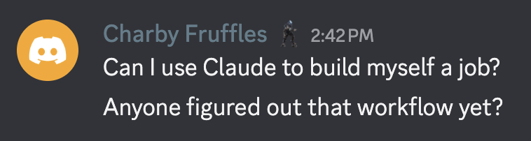

# get_a_job



Yes, Charby. We figured out the workflow.

---

This directory contains a complete multi-agent orchestration flow for building a job from scratch — not finding one, but constructing one. Designed for someone with Claude Code skills who is unemployed and ready to build their way out of it.

The flow runs 12+ agents across 5 phases, produces real artifacts at every step, and ends with a person who knows what they're doing, who they're doing it for, and what to do tomorrow morning.

## How it works

```
Phase 1  →  Deep intake interview (28 questions, honest answers)
Phase 2  →  7 agents in parallel: 5 income-model scanners + persona builder + opportunity scorer
Phase 3  →  Human picks the job (the only decision a machine can't make)
Phase 4  →  3 agents in parallel: technical stack + first-revenue plan + content system
Phase 5  →  Everything integrated into a daily operating procedure
```

## The documents

| File | What it is |
|------|-----------|
| `00_orchestration_master.md` | Start here. Agent topology, phase gates, global I/O. |
| `01_discovery_intake.md` | INTAKE_AGENT — 28-question structured interview |
| `02_market_scanner.md` | 5 parallel scanners: freelance, SaaS, consulting, content, hybrid |
| `03_persona_builder.md` | PERSONA_BUILDER_AGENT — market-facing identity and proof points |
| `04_opportunity_scorer.md` | OPPORTUNITY_SCORER_AGENT — weighted scoring across 8 dimensions |
| `05_convergence_gate.md` | The human checkpoint — pick the job |
| `06_job_architecture.md` | ARCHITECTURE_AGENT — minimum viable technical stack |
| `07_go_to_market.md` | GTM_AGENT — first-revenue plan with ready-to-send messages |
| `08_content_engine.md` | CONTENT_AGENT — credibility and lead-gen content system |
| `09_operations_playbook.md` | OPERATIONS_AGENT — daily/weekly operating procedure |
| `10_contingency_matrix.md` | 5 failure modes with recovery agent prompts |
| `11_30_day_launch_plan.md` | Day-by-day calendar, Day 21 target: first revenue received |

## What "built" means

The job is **built** when:
- `chosen_job.json` exists and the person has committed to it
- `final_operations_playbook.md` exists and the person has read it
- 5 personalized outreach messages have been sent
- At least one person has responded with interest
- The person knows exactly what to do tomorrow morning

The job is **running** when at least $1 of real money has been received from a real person.

## To run it

See `CLAUDE.md` for instructions on running the workflow in a Claude Code session.
